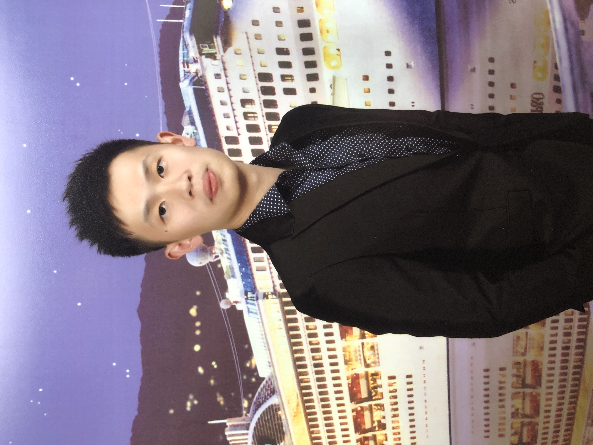

{: .profile-image}

Welcome to my personal website! I am Tiger Chen, a recent Master graduate at the University of Chicago, specializing in Computer Science. Here, you will find an overview of my academic projects, and a bit about my personal journey in the field of Computer Science. Feel free to explore!

Here's a brief overview of my academic journey:
- Undergraduate studies: I completed my B.E. in Mechanical Engineering at the University of Washington
- Graduate studies: I completed my M.S. in Computer Science at the University of Chicago
- Interests: Full-Stack Application, Data Engineer, IOS Application

Feel free to connect with me via [email](mailto:chenyinlin1998@gmail.com) or on [GitHub](https://github.com/tigeryy87).

